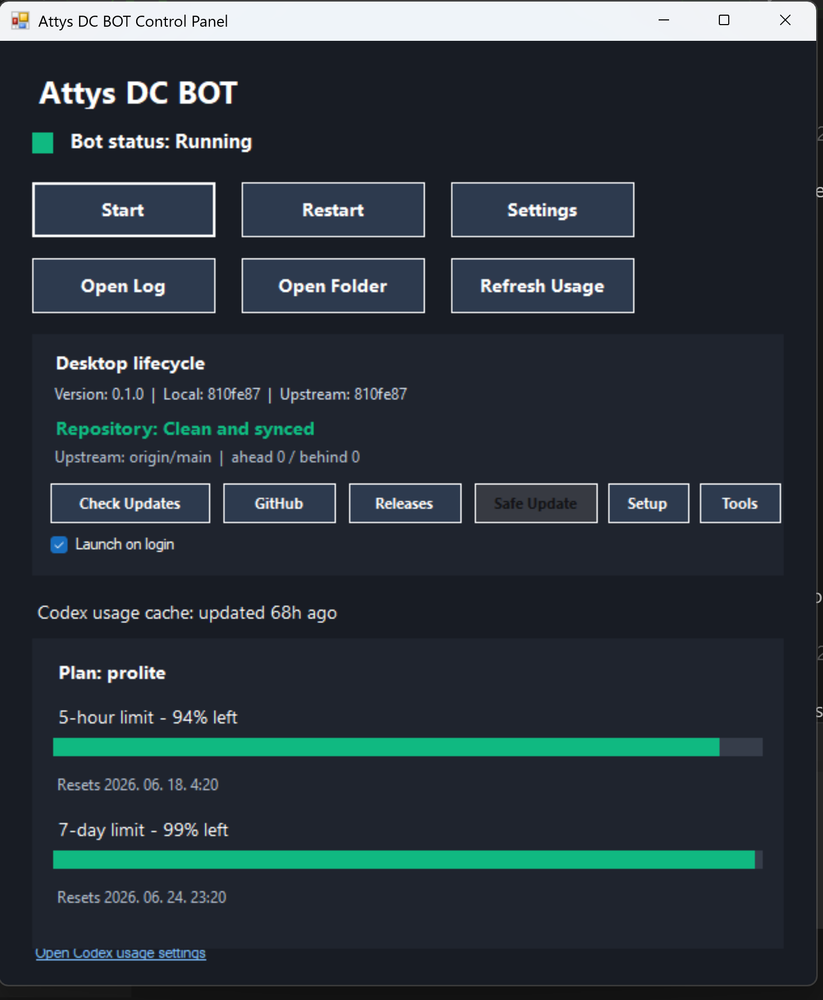
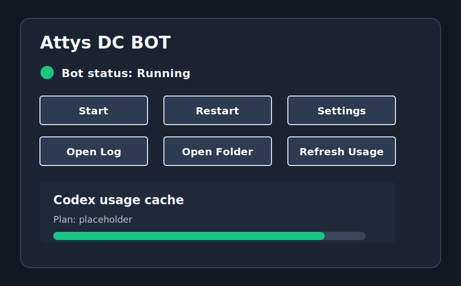
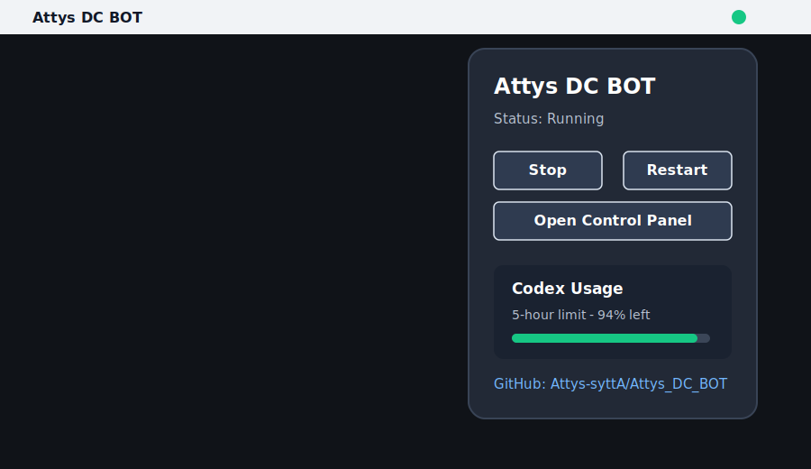

# Attys DC BOT

Control local Codex workspaces from Discord on your own machine.

Attys DC BOT is a local-first Discord control surface for Codex CLI. It runs on the same host as your local repositories, your Git tools, your `codex login` session, and your optional local operator tooling. One Discord channel can be mapped to one local project, so you can start, resume, inspect, and stop Codex work from Discord without exposing a remote execution server.

**No manually pasted OpenAI API key is required for normal use.** The bot uses your local `codex login` session.

This project follows the local-first direction of [chadingTV/codex-discord](https://github.com/chadingTV/codex-discord), with Attys-specific Windows tooling, explicit file handoff, operator preflight, and public-safety hardening added for this repository.

> Setup guide: [SETUP.md](SETUP.md)<br>
> Public support notes: [docs/PUBLIC_SUPPORT.md](docs/PUBLIC_SUPPORT.md)<br>
> Source parity matrix: [docs/SOURCE_PARITY_MATRIX.md](docs/SOURCE_PARITY_MATRIX.md)<br>
> Release checklist: [docs/RELEASE_CHECKLIST.md](docs/RELEASE_CHECKLIST.md)

## What This Project Is

`Attys_DC_BOT` is a self-hosted Discord bot that sits beside Codex CLI on your own machine.

It gives you a Discord-native operator surface for Codex:

- register a Discord channel to a local project folder
- send explicit `/ask` prompts, with optional attachments
- resume existing local Codex threads for that project
- answer Codex approvals and user-input questions from Discord
- queue follow-up prompts while a task is already running
- inspect runtime health, logs, events, usage, sessions, and mappings
- start, stop, restart, and inspect the Windows bot process through a tray panel

Because it reads local Codex thread storage where supported, sessions created from VS Code Codex can also appear in Discord for the same project path.

## Why Use Discord for Codex?

- Discord is already available on phone and desktop
- channel-per-project mapping keeps context easy to scan
- push notifications work well for approvals and task completion
- buttons and select menus cover the most common operator actions
- the bot stays local: Discord controls the local Codex session, but this repo does not open a custom remote execution server

## Key Features

- Uses your logged-in Codex account via `codex login`
- One Discord channel = one local project directory under `BASE_PROJECT_DIR`
- SQLite-backed project/session mapping
- Local Codex app-server protocol integration
- Local rollout/session fallback for `/last` and `/sessions`
- Discord approval UI for tool calls and file changes
- Codex user-input questions surfaced in Discord
- Queue confirmation and queue management
- `/ask` attachment support for up to three files
- Public-safe `/health`, `/events`, `/logs`, `/doctor`, and `/dashboard`
- Windows launcher, tray/control panel, and desktop lifecycle controls
- Linux launcher plus Python tray/control panel for desktop host operation
- macOS launcher scripts plus source-derived menu bar app for desktop host operation
- Codex usage cache display in Discord and desktop panels
- Optional VS Code-free operator tools preflight for local MCP/Docker/Obsidian readiness
- Allowed-user or allowed-role access control
- Rate limiting, path validation, attachment filtering, and output sanitizing

## How It Works

```text
[Discord]
    |
    v
[discord.js bot on your host machine]
    |
    v
[local Codex session manager]
    |
    +--> Codex app-server protocol
    +--> local codex login state
    +--> local project folders under BASE_PROJECT_DIR
    +--> local SQLite mapping state
    +--> local rollout/session logs where available
```

- The bot stores channel-to-project mappings in local SQLite.
- `/register` links a Discord channel to a local folder under `BASE_PROJECT_DIR`.
- `/ask` or message prompts start or resume Codex work for that project.
- Assistant output is streamed back to Discord and split safely for long messages and code blocks.
- Operator events are written to ignored local logs and can be inspected from Discord without exposing secrets.

## Requirements

- Windows, Linux, or macOS host
- Node.js 20+
- Codex CLI installed
- Local `codex login`
- Discord bot token
- Discord server ID
- At least one allowed Discord user ID or role ID

Normal use does **not** require `OPENAI_API_KEY`; the bot uses the local Codex login session.

## Installation

```powershell
git clone https://github.com/Attys-syttA/Attys_DC_BOT.git
cd Attys_DC_BOT
cmd /c install.bat
```

Linux or macOS:

```bash
git clone https://github.com/Attys-syttA/Attys_DC_BOT.git
cd Attys_DC_BOT
./install.sh
```

Manual setup:

```powershell
npm install
Copy-Item .env.example .env
npm run build
```

Edit `.env` with real local values. Never commit `.env`.

Recommended Codex login check on Windows:

```powershell
codex.cmd login status
```

If `codex.cmd` is not available, test the Codex command that works on this machine before starting the bot.

## Quick Start

1. Log in to Codex on the same Windows account that will run the bot.

```powershell
codex.cmd login
codex.cmd login status
```

2. Create and fill `.env`.

```powershell
Copy-Item .env.example .env
notepad .env
```

Minimum keys:

```env
DISCORD_BOT_TOKEN=
DISCORD_APPLICATION_ID=
DISCORD_GUILD_ID=
ALLOWED_USER_IDS=
BASE_PROJECT_DIR=C:\workspace
DISCORD_REGISTER_COMMANDS=true
DISCORD_ENABLE_MESSAGE_PROMPTS=false
```

3. Start the bot.

```powershell
cmd /c win-start.bat
cmd /c win-start.bat --status
```

Linux:

```bash
./linux-start.sh
./linux-start.sh --status
```

macOS:

```bash
./mac-start.sh
./mac-start.sh --status
```

4. In Discord, run:

```text
/doctor
/register path:<project-folder>
/dashboard
/ask prompt:<what you want Codex to do>
```

## Windows Control Panel

The Windows tray app opens a local operator panel for the same bot instance.

<p align="center">
  
</p>

The screenshot above is public-safe for this repository: it does not include tokens, Discord IDs, private paths, or local configuration values.

The panel provides:

- visual bot status
- `Start`, `Stop`, and `Restart`
- local `.env` settings editor based on `.env.example`
- `bot.log` opener
- repository folder opener
- Codex usage cache view with refresh
- package version and local/upstream commit display
- clean/dirty/ahead/behind git status
- read-only `Check Updates`
- guarded `Safe Update`
- operator tools preflight button
- Windows login startup toggle

`Check Updates` is read-only apart from `git fetch`. `Safe Update` is enabled only for clean repositories and uses `git pull --ff-only`; it does not run `git stash`, `git reset --hard`, or history rewriting.

The same safe-update policy is available from any platform:

```bash
npm run safe-update:status
npm run safe-update:apply
```

`safe-update:apply` runs only when the repo is clean and behind `origin/main`. It uses `git pull --ff-only`, runs `npm install` only when package files changed, then runs `npm run build` and `npm run check`. It writes local output to ignored `update.log`.

## Linux And macOS Launchers

The repository includes initial cross-platform host launchers:

- `install.sh` checks Node.js 20+, notes Codex CLI availability, runs `npm install`, and builds the project.
- `linux-start.sh` starts the bot through `systemd --user` when available, with a `nohup` fallback for simpler sessions.
- `mac-start.sh` starts the bot through `launchd`, with foreground diagnostics through `--fg`.

These launchers use the same local `.env`, `bot.log`, `bot.err.log`, and `dist/index.js` entrypoint as Windows.

Linux desktop users can also run the source-derived, Attys-branded panel:

```bash
python3 -m pip install --user pystray Pillow
python3 tray/codex_tray.py
# or open the standalone panel
python3 tray/codex_control_panel.py
```

The Linux tray/control panel can show status, start/stop/restart through `linux-start.sh`, open logs/folder/settings, show Codex usage cache, and check for upstream updates read-only. It does not run destructive auto-update actions.

<p>
  
</p>

For Windows-hosted Linux acceptance, use Debian WSL2 with Linux-native Node.js and no inherited Windows `node`/`npm` PATH entries. See `docs/LINUX_WSL_DEBIAN.md`, then run:

```bash
bash scripts/linux-wsl-acceptance.sh
```

For an actual WSL-hosted bot run, copy `.env.wsl.example` to `.env`, fill the local Discord values, and run `codex login` inside Debian first.

macOS desktop users can build the source-derived, Attys-branded menu bar app on a Mac with Xcode Command Line Tools:

```bash
swiftc menubar/CodexBotMenu.swift -o menubar/CodexBotMenu
./menubar/CodexBotMenu
```

The menu bar app uses the same `mac-start.sh`/launchd lifecycle contract, shows status and Codex usage, opens logs/folder/settings, and keeps update actions read-only.

<p>
  
</p>

## Commands

| Command | What it does |
|---|---|
| `/register path:` | Link the current channel to a local project folder |
| `/unregister channel:` | Remove the current or selected legacy channel mapping |
| `/status` | Show registered project status, runtime state, queue size, and pending action |
| `/dashboard` | Show the channel control center and recent public-safe operator events |
| `/doctor` | Check config, Codex readiness, channel mapping, and live slash command registration |
| `/health` | Show public-safe bot runtime health |
| `/events` | Show recent public-safe operator events with kind/status filtering |
| `/logs` | Show scrubbed tails from allowlisted local bot logs |
| `/bot action:` | Show launcher status or restart the bot when enabled |
| `/tools action:` | Run or inspect the VS Code-free operator tools preflight |
| `/ask prompt:` | Send an explicit prompt and optional file attachments to Codex |
| `/session current/new/stop` | Inspect, reset, or stop the channel's Codex session |
| `/sessions` | Filter, inspect, and resume known local Codex sessions |
| `/last` | Show the last known assistant response with local fallback |
| `/queue list/clear/remove` | Inspect or manage queued prompts |
| `/mappings` | List project-channel mappings and clean duplicate legacy mappings |
| `/git-status` | Run read-only `git status --short --branch` for the registered project |
| `/run-tests` | Run `npm test` in the registered project when enabled |
| `/usage` | Show local Codex usage/rate-limit information when available |
| `/auto-approve` | Toggle approval bypass when explicitly enabled |
| `/clear-sessions` | Delete local session files when explicitly enabled |
| `/help` / `/sugo` | Show categorized Hungarian help |

## Typical Workflow

1. Start the bot with `win-start.bat` or the desktop shortcut.
2. Run `/doctor` to confirm config, Codex login, and slash command registration.
3. In a Discord channel, run `/register`.
4. Use `/dashboard` to confirm the channel/project/session state.
5. Send work with `/ask`.
6. Approve, deny, answer, queue, stop, or inspect from Discord as needed.
7. Use `/events`, `/logs`, `/health`, and `/last` when operating away from the Windows desktop.

## Project Path Model

The bot enforces a base directory boundary:

- `BASE_PROJECT_DIR` is the root users are allowed to register under
- `/register my-app` becomes `BASE_PROJECT_DIR\my-app`
- nested paths like `/register apps/api-server` are supported
- absolute paths are allowed only if they still resolve inside `BASE_PROJECT_DIR`
- if the folder does not exist yet, `/register` can create it

This keeps the Discord UI simple while preventing path traversal outside the allowed workspace root.

## Attachments

When you attach files through `/ask` or the explicit `Send to Codex` message command:

- files are downloaded into the project-local `.codex-uploads/` folder
- images and files are appended to the Codex prompt as local references
- executable and dangerous file types are rejected
- local saved paths are not echoed back to Discord

Optional source-repo parity mode:

- `DISCORD_ENABLE_ATTACHMENT_MESSAGES=true` lets normal Discord messages with both text and attachments become Codex prompts in registered channels.
- Attachment-only normal messages do not start blind work; the bot replies with guidance to use `Send to Codex` or `/ask`.
- This mode requires Discord's privileged Message Content intent, just like normal message prompts.

## Security Model

- `.env` is ignored and must stay local
- runtime SQLite state, logs, uploads, generated binaries, and Codex auth state are ignored
- access is limited to configured allowed users or roles
- project registration is restricted to `BASE_PROJECT_DIR`
- executable attachments are blocked
- no custom HTTP execution server is opened by this project
- message prompts require Discord's privileged Message Content intent; slash commands and the explicit `Send to Codex` file handoff can run without normal message prompts
- command and file-change auto-approval is disabled unless `DISCORD_ENABLE_AUTO_APPROVE=true`
- session deletion is disabled unless `DISCORD_ENABLE_SESSION_DELETE=true`
- Discord-side bot restart is disabled unless `DISCORD_ENABLE_BOT_LIFECYCLE=true`
- `/logs`, `/events`, `/health`, `/doctor`, and `/dashboard` avoid tokens, raw Discord IDs, private paths, and config values

## Configuration

Important `.env` keys:

| Key | Purpose |
|---|---|
| `DISCORD_BOT_TOKEN` | Discord bot token, local only |
| `DISCORD_APPLICATION_ID` | Optional app ID to avoid runtime lookup |
| `DISCORD_GUILD_ID` | Target Discord server |
| `DISCORD_NOTIFICATION_CHANNEL_ID` | Optional central operator notification channel |
| `ALLOWED_USER_IDS` | Comma-separated allowed Discord user IDs |
| `ALLOWED_ROLE_IDS` | Optional allowed Discord role IDs |
| `BASE_PROJECT_DIR` | Workspace root that `/register` may use |
| `DISCORD_DATABASE_PATH` | Local SQLite state path |
| `DISCORD_SESSION_STORE_PATH` | Local session store path |
| `DISCORD_ENABLE_MESSAGE_PROMPTS` | Whether normal text messages can become prompts |
| `DISCORD_ENABLE_ATTACHMENT_MESSAGES` | Whether normal text+attachment messages can become prompts |
| `DISCORD_REGISTER_COMMANDS` | Whether startup registers slash commands |
| `DISCORD_ENABLE_RUN_TESTS` | Enables `/run-tests` |
| `DISCORD_ENABLE_AUTO_APPROVE` | Enables approval bypass toggle |
| `DISCORD_ENABLE_SESSION_DELETE` | Enables destructive session deletion |
| `DISCORD_ENABLE_BOT_LIFECYCLE` | Enables Discord-triggered bot restart |

Tracked examples and docs must use placeholders only.

## Validation

```powershell
npm run lint
npm run typecheck
npm test
npm run build
npm run check
npm run doctor:local
ggshield secret scan path --recursive --yes --use-gitignore .
```

Launcher smoke test on Windows:

```powershell
cmd /c win-start.bat --stop
cmd /c win-start.bat --status
cmd /c win-start.bat
cmd /c win-start.bat --status
cmd /c win-start.bat --stop
```

Launcher smoke test on Linux:

```bash
./linux-start.sh --help
./linux-start.sh --status
./linux-start.sh
./linux-start.sh --status
./linux-start.sh --stop
```

Launcher smoke test on macOS:

```bash
./mac-start.sh --help
./mac-start.sh --status
./mac-start.sh
./mac-start.sh --status
./mac-start.sh --stop
```

## CI And Repository Protection

- GitHub Actions CI runs lint, plan check, typecheck, tests, and build on Node.js 20 and 22.
- SQLite Check verifies the native `better-sqlite3` dependency.
- Secret Scan runs GitGuardian/ggshield when `GITGUARDIAN_API_KEY` is configured as a repository secret.
- Dependabot checks npm and GitHub Actions dependencies weekly.

## Current Scope

In scope:

- Windows/local-first Codex control
- initial Linux/macOS launcher support
- Discord operator UX
- local SQLite mapping state
- local Codex login/session usage
- public-safe docs and diagnostics

Out of scope:

- remote execution bridge
- custom HTTP execution agent
- multi-machine state sharing
- network-share or portable-drive workflow
- macOS menu bar desktop parity until the cross-platform plan is completed

## License

MIT. See [LICENSE](LICENSE).
